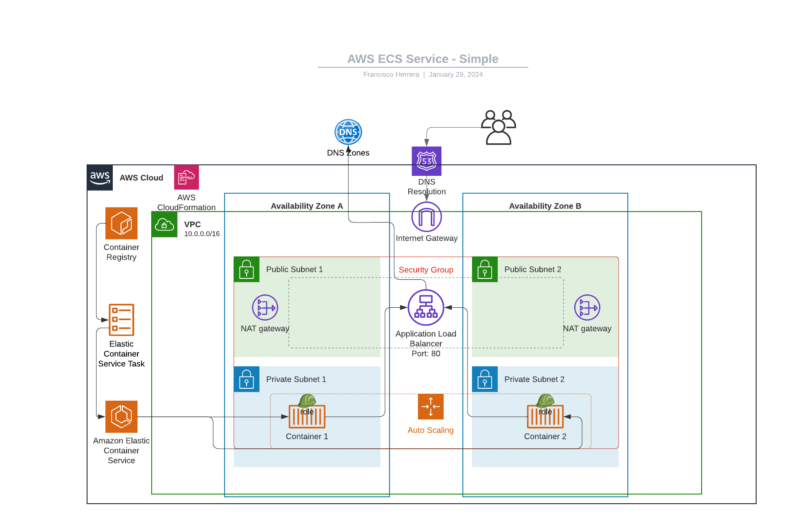

# cloudformation-test
DevOps Assesment task

**Resources created**:

***VPC***: This is the central component. Visualize it as a large container enclosing all other components.

***Public Subnets***: Inside the VPC, draw two subnets labeled as "Public Subnet 1" and "Public Subnet 2." In each, place an icon for a NAT Gateway. Also, in one of the public subnets, include an icon representing the Application Load Balancer (ALB).

***Private Subnets***: Add two more subnets labeled as "Private Subnet 1" and "Private Subnet 2." These host the ECS Fargate tasks.

***ECS Cluster and Tasks***: Within the private subnets, draw icons representing ECS Fargate tasks running the Nginx containers.

***Security Groups***: Around the ALB and ECS tasks, draw outlines to represent the security groups controlling access.

***Auto Scaling***: Near the ECS tasks, add an icon or label to represent the Auto Scaling setup.

***IAM Roles***: Include icons for IAM roles near the ECS tasks and Auto Scaling setup to denote permissions management.

***Traffic Flow***: Use arrows to show traffic flow from the internet to the ALB, from the ALB to the ECS tasks, and from the ECS tasks to the NAT Gateways.

***External Connections***: Show the connection from the NAT Gateways and the ALB to the internet.

**Docker Image**
Simple Nginx service running from latest content in Docker Hub
Serving a basic landing page using HTML